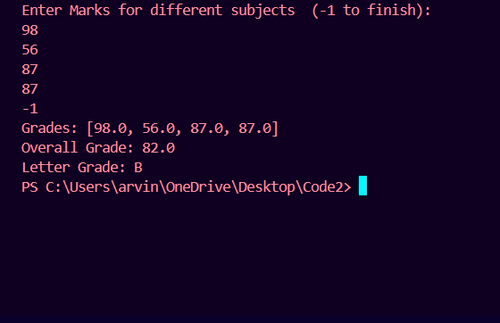

# Overview
* Develop a Java program to track and manage student grades. The program
should allow the user to input grades for different subjects or assignments, calculate the average grade, and display the overall grade along with any additional information (such
as letter grade or GPA).

## Table of Contents
- [Requirements](#requirements)
- [Files](#files)
- [How to Run](#how-to-run)
- [Example Output](#example-output)

## Requirements
* Java Development Kit (JDK) 17 or higher
* Integrated Development Environment (IDE) such as IntelliJ IDEA or Eclipse

# Clone repository
bash
git remote add origin 

## Files

## How to Run

1. Compile the Java Files:

* If using the command line, navigate to the directory containing the .java files and run:

bash
javac Student.java StudentGUI.java

* If using an IDE, simply open the project and build it.

2. Run the Program:

* If using the command line, run the compiled program:
bash
java Calculator

## Example Output

# Author
* Pankaj Kumar -https://github.com/pankajk12
